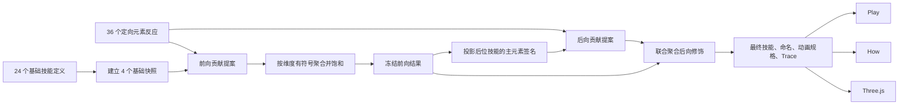

# V6 可执行设计包

## 1. 文档定位

本目录把 `docs/contracts/asymmetric-mutual-feedback.md` 中已经确认的方向，进一步收敛为可直接编码的数据、公式、输出合同和验收标准。

它服务于两类读者：

1. 继续参与系统设计的人，用它检查规则是否合理、是否符合直觉。
2. 接手编码的 AI 或工程师，用它实现 V6，而不需要自行补全核心设计。

本目录不代表当前代码已经实现 V6。

## 2. 文档优先级

发生冲突时，按以下顺序处理：

1. `AGENTS.md`
2. `docs/CONSTITUTION.md`
3. 本目录下的 V6 文档
4. `docs/contracts/asymmetric-mutual-feedback.md`
5. 旧版 `docs/contracts/data-structures.md`、`docs/contracts/engine-pipeline.md`、`docs/contracts/page-specs.md`
6. V4/V5 设计稿和当前代码行为

旧文档中关于 16 维向量、候选能力竞选、位置编码注意力等内容，可以作为历史背景，但不再约束 V6 的核心实现。

## 3. 阅读顺序

| 顺序 | 文档 | 解决的问题 |
|---|---|---|
| 1 | `base-skills.md` | 24 个技能各自是什么，哪些内容绝不能被互馈改掉 |
| 2 | `element-reactions.md` | 6×6 个有方向的元素关系分别允许产生什么变化 |
| 3 | `engine-spec.md` | 如何把前向、后向、距离、权威度和多来源贡献计算成结果 |
| 4 | `presentation-and-migration.md` | Play、How、Three.js 如何展示，以及如何从现有代码迁移 |

编码前必须完整阅读四份文档，不能只读取数据表。

## 4. 一句话模型

```text
每枚符文先是一个形态固定、主效果明确的基础技能；
前面的技能较强地改变后面技能的表现和机制；
后面的技能较轻地联合修饰前面的技能；
所有变化都来自定向元素规则和连续聚合，并输出真实 Trace。
```

## 5. 已确定且不得擅自改动的结论

1. 四个槽位是四个独立技能，不是同一技能的四个阶段。
2. 基础技能的主形态固定。投射物不能因为互馈变成领域或召唤物。
3. 一个基础技能只有一个主效果，互馈最多附加少量可辨识变化。
4. 前向影响强于后向影响，且越近越强。
5. 后向影响由所有后位技能共同计算，越靠后的技能权威度越高。
6. 不采用 Softmax，不采用只保留 Top-K，不用完整排列查表。
7. 正向、负向和机制解锁可以在一次元素关系中同时存在。
8. 混合元素只影响当前技能的表现，不作为新的来源元素继续向后传播。
9. 后向计算读取已经冻结的前向结果，但只投影来源技能主元素可表达的部分。
10. 后向结果不再次触发前向或后向递归。
11. Play、How、动画必须读取同一个 `GeneratedSkill` 和同一份 `trace`。
12. 默认 A/B 案例必须在名称、关键参数、机制标签和动画上都能直接看出差异。

## 6. V6 的核心数据流



## 7. 实现边界

V6 必须继续满足：

- 纯前端本地计算。
- 核心规则位于 `src/engine/`，并保持纯函数。
- 基础数据位于 `src/data/`，不在 UI 中维护规则副本。
- `generateBuildV6(sequence)` 对相同输入必须产生完全相同的输出。
- 不得以四枚符文的完整排列作为 key 查询预制结果。
- 文案模板可以查表，但模板只能消费真实计算结果，不能决定结果。
- 动画模板可以按固定形态选择，但动画参数必须来自真实技能结果。

## 8. 交付完成定义

一名不了解前序讨论的编码者，只读取本目录和最高优先级文档后，应能完成：

1. 建立 V6 类型与数据。
2. 实现无副作用的双向计算管线。
3. 为任意合法的 4 技能序列生成技能结果和完整 Trace。
4. 在 Play 中显示基础值、当前值和来源变化。
5. 在 How 中解释每一项变化来自谁、为何发生、如何聚合。
6. 用固定形态动画表达不同元素和构筑变化。
7. 通过默认 A/B、交换顺序、禁用能力和无关系输入等测试。

## 9. 编码时的建议入口

推荐先实现并测试以下纯函数，再连接 UI：

```ts
getBaseSkill(seedId)
getDirectedReaction(sourceElement, targetElement)
computeForwardPass(baseSkills)
projectOutboundSignature(forwardSkill)
computeBackwardPass(forwardSkills)
finalizeGeneratedSkills(resolvedSkills)
generateBuildV6(sequence)
diffBuilds(previousBuild, nextBuild)
```

任何一个函数都不应读取 React state、DOM、Three.js 对象、时间、随机数或网络。
